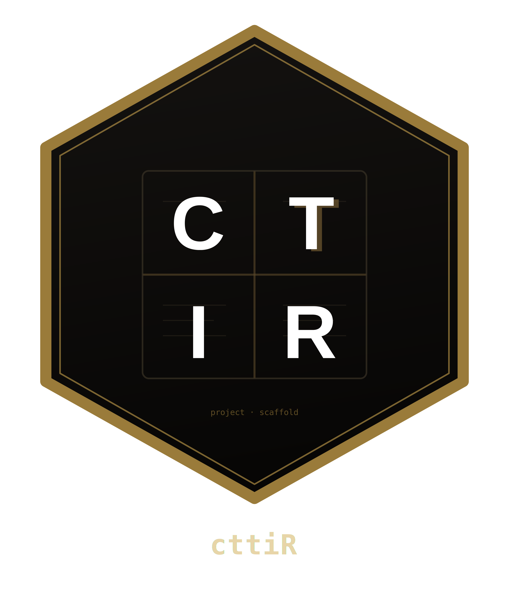

# cttiR 

**CTTIR Project Builder — three inputs, one research-ready project.**

cttiR creates a standardized research project from a name, a research type and
a goal, routes it to a reviewed analysis workflow, and keeps a revision-scoped
knowledge catalog of the packages that workflow is allowed to call.

```r
p <- cttiR::project(
  "Example Study", "primary_research",
  "Describe outcomes and plan an adjusted regression for a tabular cohort",
  path = tempdir()
)
p
```

`path` is an existing **parent** directory; this creates `example_study/`.
Use `dry_run = TRUE` for a read-only preview. Creation never reads data,
installs packages, calls a model or contacts a network.

## What a project contains

* `cttir-project.yml`, `cttir-lock.json` and ownership metadata; publication
  subprojects with their own analysis, manuscript, figure and table trees.
* The adapted reflowR layout and a reviewed stage library in `code/R/`:
  delimited import, structural checks, tidy role selection, DescrTab2 or base
  descriptive tables (no tests), accessible ggplot2/patchwork figures,
  lm/glm/nlme/survival adapters, diagnostics and broom effect estimates.
* `config/workflow.yml` with the routed profile, stages, approval status and
  dependency versions pinned from the catalog snapshot.
* `Rscript code/run_demo.R`: every stage on synthetic data, with each model
  adapter checked against an independent reference computation.
* `Rscript code/run_workflow.R`: study data only after mappings, reviewed model
  settings, recorded approval, a local binding and approved pinned packages are
  present — otherwise it lists exactly what is missing.
* Optional `targets` pipeline, renv environment (prepared in an isolated
  process) and Git initialisation of the project root only.

## Routing

The router selects `standard_reflowR` when no approved CTTIR specialist adapter
matches, `hybrid` when approved specialist stages cover part of the work, and
records specialist candidates without adapters as explicit gaps. Goal keywords
only suggest unset fields (recorded as `inferred` decisions); explicit options
always win, and nothing is approved by inference. Biological modalities list
Bioconductor and Seurat capabilities; clinical tabular goals never route there.

## Knowledge catalog and approvals

```r
cttiR::packages()                       # 62 package revisions with coverage and approvals
cttiR::search("nlme::lme")              # revision-scoped evidence
cttiR::ask("Fit a mixed model for repeated measures")
cttiR::resources("cytometry", repository = "Bioconductor")
```

The bundled catalog indexes 30 public CTTIR package roots and the standard
workflow family from verified CRAN, Bioconductor and R 4.6.1 sources. Reviewed
approvals bind each workflow role to an exact source revision with stored
reference topics and passing fixture tests; generated code calls only approved
APIs, which `audit()` re-checks. `ask()` answers from that catalog with cited,
validated snippets and reports gaps instead of inventing APIs.
`update()` refreshes registered local, GitHub, CRAN or Bioconductor sources into
new immutable snapshots (never installing packages); `rollback_knowledge()`
restores an earlier one. Project pins never change implicitly.

## Maintenance and checks

* `sync()` previews and applies explicit configuration changes and preserves
  edited user files.
* `audit()` runs a registry of installation, knowledge, project and standard
  workflow checks with an explicit repair allowlist; `doctor()` is the brief
  read-only subset. Readiness levels (`scaffold_ready` to `analysis_ready`)
  come from local evidence such as receipts and pinned versions.
* `setup()` prepares an owned, cloud-disabled Ollama runtime on Linux x86_64.
  The tested local models did not meet the planning thresholds, so the
  deterministic planner is the default; opt in with
  `options(cttiR.planner = "local_llm")`.
* `setup_app()` and `configure()` open the local Shiny application (Fast and
  Detailed creation with a bilingual questionnaire, Ask, Knowledge, Resources,
  Audit and Runtime views).

See the vignettes for the getting-started walkthrough, the standard workflow,
knowledge and approvals, and audit/runtime/privacy. The development record is
in [CURRENT_STATE.md](CURRENT_STATE.md).

## Limits

Approvals cover pinned package revisions and adapters, not scientific
conclusions. Prediction, causal, count, Bayesian and specialist CTTIR analyses
have no reviewed adapter yet and are reported as gaps. Keyword-based answers are
safe but recall on unseen phrasing is limited (see the held-out benchmark).
Runtime acquisition is verified on Linux x86_64 only.

MIT licensed.
